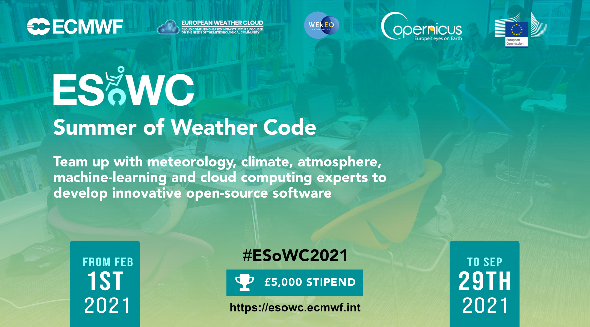

# ECMWF Summer of Weather Code 2021

ECMWF Summer of Weather Code is a collaborative programme where each summer several developer teams work on innovative weather-, climate- and atmosphere-related open-source software. ESoWC is organised by the [European Centre for Medium-Range Weather Forecasts (ECMWF)](https://www.ecmwf.int/) and supported by [Copernicus](https://climate.copernicus.eu).

 

</img>

 

## ESoWC 2021 Challenges

There are three challenge streams:

</img>

### Stream 1 - Software development for weather, climate and atmosphere

 

* [Challenge 11 - Jupyter widgets to help process and explore meteorlogical data](https://github.com/esowc/challenges_2021/issues/1)
* [Challenge 12 - Size, precision, speed - pick two: implementation](https://github.com/esowc/challenges_2021/issues/2)
* [Challenge 13 - ORIGAMI (global river gauges mapping)](https://github.com/esowc/challenges_2021/issues/5)
* [Challenge 14 - Atmospheric composition data comparison toolbox](https://github.com/esowc/challenges_2021/issues/7)
* [Challenge 15 - Development of satellite simulation web tool](https://github.com/esowc/challenges_2021/issues/8)
* [Challenge 16 - ECMWF User Profile Page](https://github.com/esowc/challenges_2021/issues/12)
* [Challenge 17 - The CDS-RTTOV-box] https://github.com/esowc/challenges_2021/issues/15

 

</img> 

### Stream 2 - Machine Learning for weather, climate and atmosphere applications

 

* [Challenge 21 - Machine Learning to improve the CAMS global air quality forecasts](https://github.com/esowc/challenges_2021/issues/6)
* [Challenge 22 - ML4Land](https://github.com/esowc/challenges_2021/issues/9)
* [Challenge 23 - Mapping Emissions of Air Pollutants](https://github.com/esowc/challenges_2021/issues/11)
* [Challenge 24 - CliMetLab - Machine Learning on weather and climate data](https://github.com/esowc/challenges_2021/issues/13)

 

</img>

### Stream 3 - Visualize weather, climate and atmosphere

 

* [Challenge 31 - ECMWF forecast data in 3D with Blender](https://github.com/esowc/challenges_2021/issues/4)
* [Challenge 32 - Building interactive weather visualisations](https://github.com/esowc/challenges_2021/issues/3)
* [Challenge 33 - WEkEO in a glance](https://github.com/esowc/challenges_2021/issues/10)

 

*Note: Successful projects will be eligible for a stipend of £ 5000 and if applicable, cloud credits from the [European Weather Cloud](https://www.europeanweather.cloud/) or [WEkEO](https://wekeo.eu/)*

 

## How it works

### 1. Application period: 1 Feb - 16 Apr 2021
Browse through the [ESoWC 2021 challenges](https://github.com/esowc/challenges_2021/issues), ask questions and together with the mentors, tailor your proposal. Apply before 16 April 2021.

### 2. Announcement of selected proposals: 30 Apr 2021
The final ESoWC 2021 project teams will be announced on 30 Apr 2021.

### 3. Coding period: 3 May  - 31 Aug 2021
The 4-month long coding period starts 3 May 2021 and lasts until 31 August 2021. During this time, the selected teams team up with experienced mentors and experts in weather, climate, atmosphere and machine-learning.   Follow the progress of the projects here on Github.

### 4. Final ESoWC day (virtual): 29 September 2021
The ESoWC day is the final day of the programme. Each team will be invited to this virutal event and present their project results.

 

## Important links
* [ESoWC Frequently Asked Questions](http://esowc.ecmwf.int/FAQ)
* [ESoWC Terms & Conditions](http://esowc.ecmwf.int/terms-and-conditions)
* Follow ESoWC on [Twitter](https://twitter.com/esowc_ecmwf), [LinkedIn](https://www.linkedin.com/showcase/ecmwf-summer-of-weather-code/) and [YouTube](https://www.youtube.com/channel/UCWLn6evyZ6tTktvUSTE1Xow)
* Read a summary of ESoWC 2020 on the ECMWF Science Blog: [ESoWC 2020 a driver of innovation](https://www.ecmwf.int/en/about/media-centre/science-blog/2020/ecmwf-summer-weather-code-driver-innovation)
* ECMWF Newsletter: [Summer of Weather Code in fourth round in 2021](https://www.ecmwf.int/en/newsletter/166/news/summer-weather-code-fourth-round-2021)
