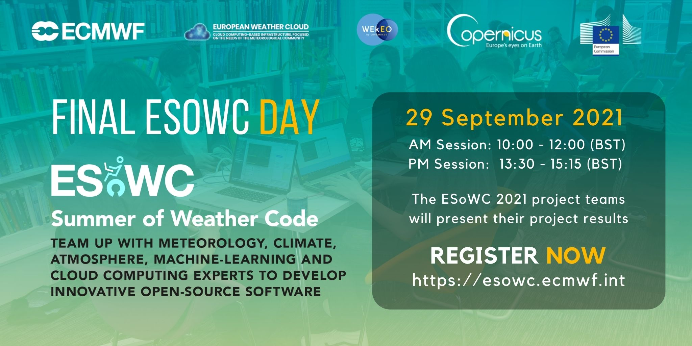
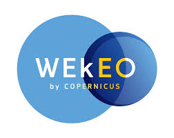

# ECMWF Summer of Weather Code 2021

ECMWF Summer of Weather Code is a collaborative programme where each summer several developer teams work on innovative weather-, climate- and atmosphere-related open-source software. ESoWC is organised by the [European Centre for Medium-Range Weather Forecasts (ECMWF)](https://www.ecmwf.int/) and supported by [Copernicus](https://climate.copernicus.eu).
 

## ESoWC 2022 - Coming soon

[</img>](https://esowc.ecmwf.int/final-esowc-day-2021-event-page)

Follow [ESoWC on Twitter](https://twitter.com/esowc_ecmwf) and sign up for our [newsletter](https://esowc.ecmwf.int/)

 
## Final ESoWC Day 2021 | Recordings
The fourth edition came to a close on 29th September with the Final ESoWC Day 2021. Watch here the recordings of the team presentations:
* [**Final ESoWC Day 2021 - Morning session**](https://www.youtube.com/watch?v=Au48CsWeQVc)
* [**Final ESoWC Day 2021 - Afternoon session**](https://www.youtube.com/watch?v=n3BACqG7ggA)

Did you miss the ESoWC 2021 mid-term webinars? No problem, watch the recordings here:
* [**ESoWC 2021 Midterm results - Session 1**](https://www.youtube.com/watch?v=L95bexzGpu4)
* [**ESoWC 2021 Midterm results - Session 2**](https://www.youtube.com/watch?v=aQiKLgAu1VY)

 

## ESoWC 2021 Projects
Congratulations to the nine teams that have been selected to be part of ECMWF Summer of Weather Code 2021:

| Project title | Team | Mentors |
| ---------- | --------------- | -------------- |
| [**Elefridge.jl: Compressing atmospheric data into its real information content**](https://github.com/esowc/Elefridge.jl)   >> [Watch the project presentation](https://www.youtube.com/watch?v=xnglSFjysVk)| [Milan Kloewer](https://github.com/milankl) | [Miha Razinger](https://github.com/miha-at-ecmwf)   [Juan-Jose Dominguez](https://github.com/juanjodd) |
| [**ADC Toolbox: Comparing Atmospheric Composition Datasets**](https://github.com/esowc/adc-toolbox)   >> [Watch the project presentation](https://www.youtube.com/watch?v=Ba6utZLD_RU)| [Alba Vilanova Cortezon](https://github.com/albavilanova) | [Miha Razinger](https://github.com/miha-at-ecmwf)   Antje Inness   Federico Fierli |
| [**ECMWF User Dashboard**](https://github.com/esowc/ecmwf-user-dashboard)    >> [Watch the project presentation](https://www.youtube.com/watch?v=lq3-L3OOspE) | [Varun Bankar](https://github.com/varunbankar/) | [Helen Setchell](https://github.com/kiden)   Carsten Maas   [Sylvie Lamy-Thepaut](https://github.com/sylvielamythepaut) |
| [**AQ-BiasCorrection**](https://github.com/esowc/aq-biascorrection)   >> [Watch the project presentation](https://www.youtube.com/watch?v=TyLZLj0njZ4) | [Antonio Perez Velsco](https://github.com/aperezvelasco)   [Mario Santa Cruz Lopez](https://github.com/JPXKQX) | [Johannes Flemming](https://github.com/JohannesFlemming)   [Miha Razinger](https://github.com/miha-at-ecmwf)   Jerome Barre |
| [**ML4Land: Using Earth's observation data, Climate reanalysis & Machine Learning to detect Earth's heating patterns**](https://github.com/esowc/ML4Land)   >> [Watch the project presentation](https://www.youtube.com/watch?v=dLPTPh_ZBgY) | [Het Shah](https://github.com/Het-Shah)   [Avishree Khare](https://github.com/avishreekh) | [Gianpaolo Balsamo](https://github.com/gpbalsamo)   [Joe McNorton](https://github.com/joemcnorton)   Gabriele Arduini   Margarita Choulga   Souhail Boussetta   Nils Wedi   [Peter Dueben](https://github.com/dueben) |
| [**MaLePoM: Machine Learning for Pollution Monitoring**](https://github.com/esowc/MaLePoM)   >> [Watch the project presentation](https://www.youtube.com/watch?v=O_1USkXqOV0) | [Nicolo Brunello](https://github.com/NicoBrunello)   [Vidur Mithal](https://github.com/vidurmithal)   [Paolo Fornoni](https://github.com/PaoloForno)   [Luca Rampini](https://github.com/crampaldo) |[Joe McNorton](https://github.com/joemcnorton)   Nicolas Bousserez   [Gianpaolo Balsamo](https://github.com/gpbalsamo)   Anna Agusti-Panareda   Mark Parrington |
| [**CliMetLab - Machine Learning on weather and climate data**](https://github.com/esowc/climetlab)   >> [Watch the project presentation](https://www.youtube.com/watch?v=RBnyB0adQ0o) |[Ashwin Samudre](https://github.com/kiryteo)  |[Baudouin Raoult](https://github.com/b8raoult)   [Florian Pinault](https://github.com/floriankrb) |
| [**BlenderNC enhancements**](https://github.com/blendernc/blendernc)   >> [Watch the project presentation](https://www.youtube.com/watch?v=wxCzHFggH9M) | [Tishampati Dhar](https://github.com/whatnick)   Gichini Ngaruiya   [Josue Martinez Moreno](https://github.com/josuemtzmo) | [Stephan Siemen](https://github.com/stephansiemen)   [Sylvie Lamy-Thepaut](https://github.com/sylvielamythepaut) |
| [**Meeresvogel**]()   >> [Watch the project presentation](https://www.youtube.com/watch?v=rDVdOcRONWs) | [Kathryn Schmitt](https://github.com/kassschmitt) | [Stephan Siemen](https://github.com/stephansiemen)   [Iain Russell](https://github.com/iainrussell)|

 
 

Generous cloud computing ressources are provided by: 
|the Copernicus DIAS service [WEkEO](https://www.wekeo.eu/) |[European Weather Cloud](https://www.europeanweather.cloud/)|
|----------------|:--------------------:|
|</img>|</img>|

 

 

## How it works

### 1. Application period: 1 Feb - 16 Apr 2021
Browse through the [ESoWC 2021 challenges](https://github.com/esowc/challenges_2021/issues), ask questions and together with the mentors, tailor your proposal. Apply before 16 April 2021.

### 2. Announcement of selected proposals: 30 Apr 2021
The final ESoWC 2021 project teams were announced on 30 Apr 2021.

### 3. Coding period: 3 May  - 31 Aug 2021
The 4-month long coding period started 3 May 2021 and lasts until 31 August 2021. During this time, the selected teams team up with experienced mentors and experts in weather, climate, atmosphere and machine-learning.   Follow the progress of the projects here on Github.

### 4. Final ESoWC day (virtual): 29 September 2021
The ESoWC day is the final day of the programme. Each team will be invited to this virtual event and present their project results.

 

## Important links
* [ESoWC Frequently Asked Questions](http://esowc.ecmwf.int/FAQ)
* [ESoWC Terms & Conditions](http://esowc.ecmwf.int/terms-and-conditions)
* Follow ESoWC on [Twitter](https://twitter.com/esowc_ecmwf), [LinkedIn](https://www.linkedin.com/showcase/ecmwf-summer-of-weather-code/) and [YouTube](https://www.youtube.com/channel/UCWLn6evyZ6tTktvUSTE1Xow)
* Read a summary of ESoWC 2020 on the ECMWF Science Blog: [ESoWC 2020 a driver of innovation](https://www.ecmwf.int/en/about/media-centre/science-blog/2020/ecmwf-summer-weather-code-driver-innovation)
* ECMWF Newsletter: [Summer of Weather Code in fourth round in 2021](https://www.ecmwf.int/en/newsletter/166/news/summer-weather-code-fourth-round-2021)
